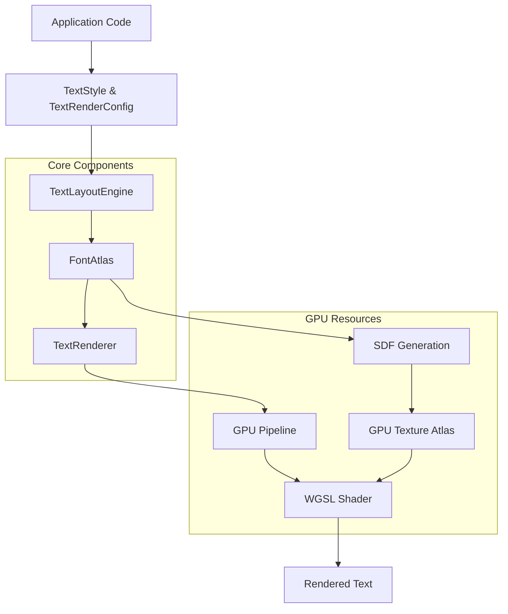
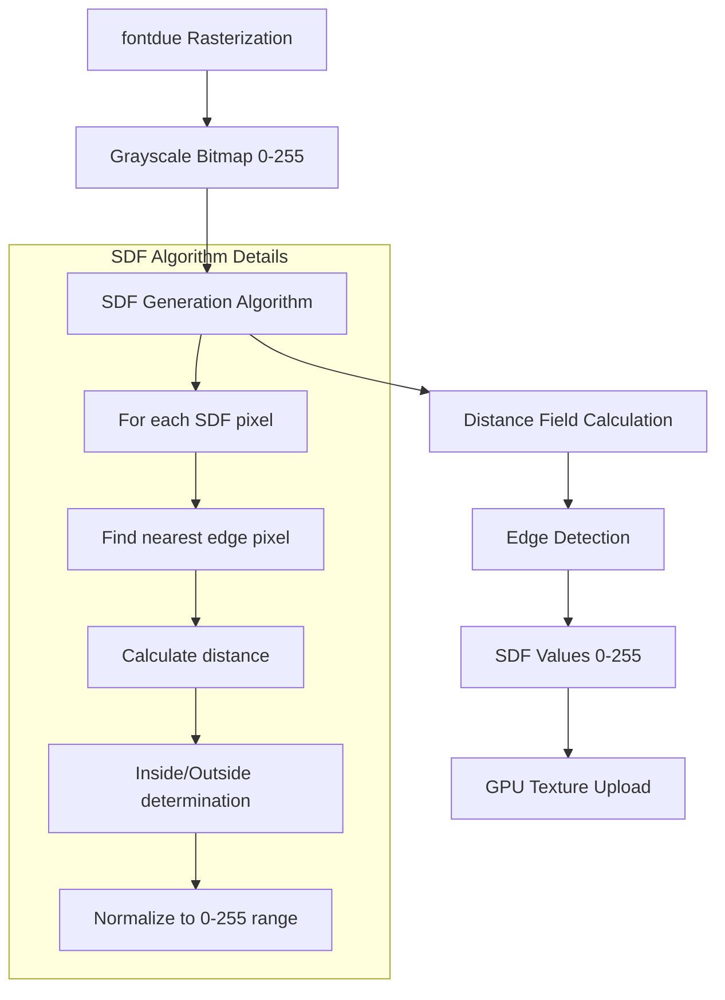
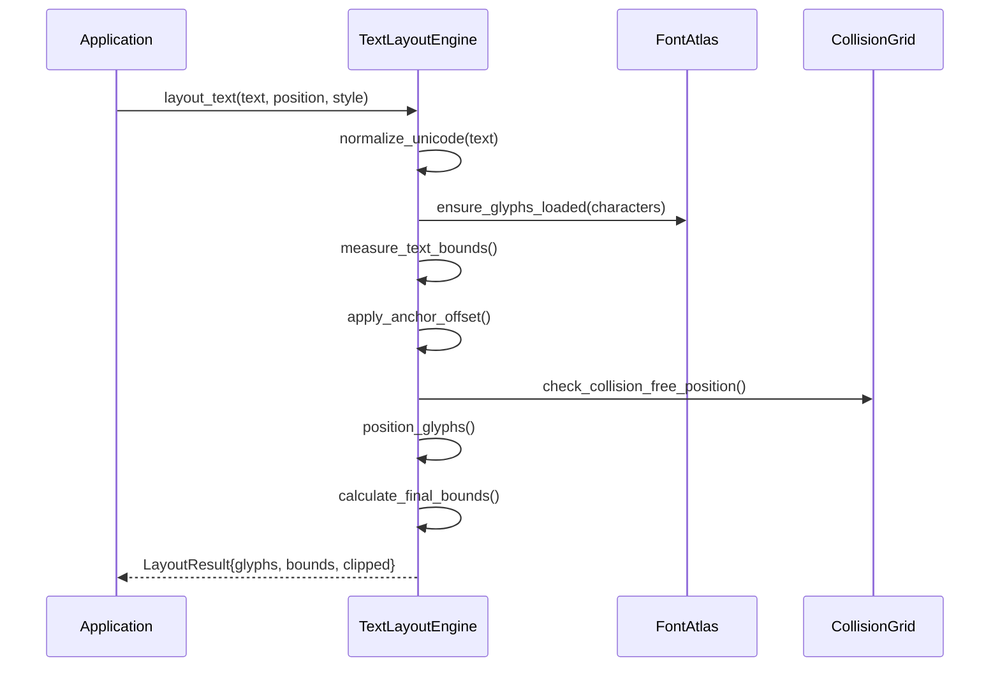
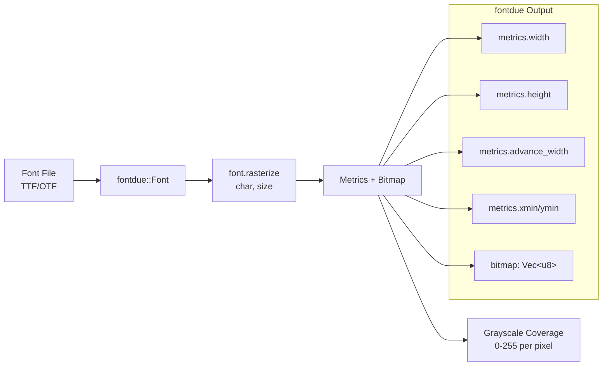
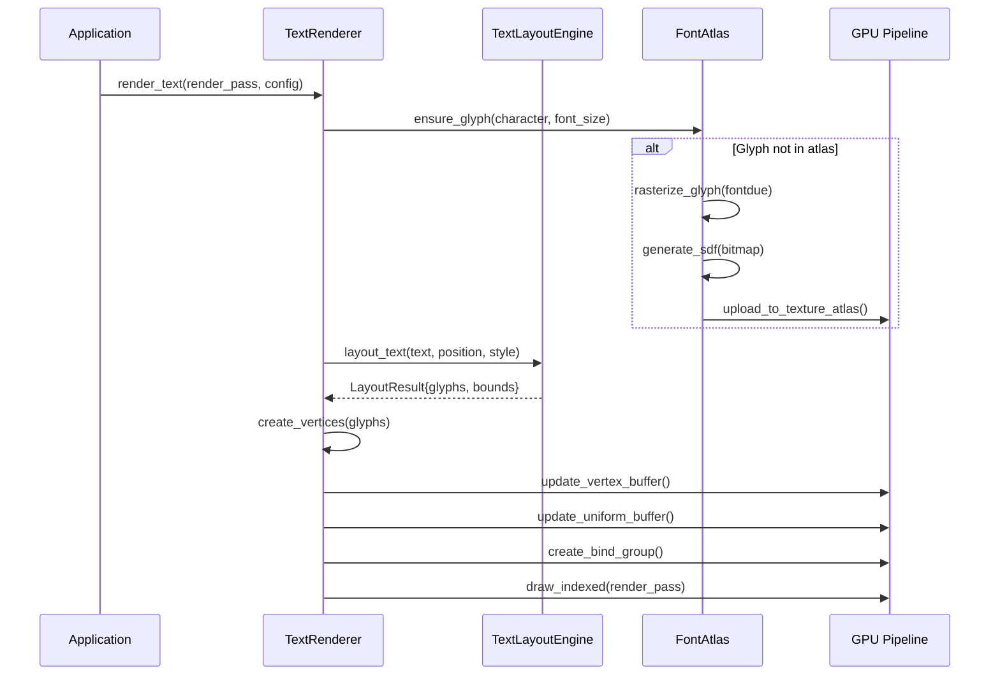
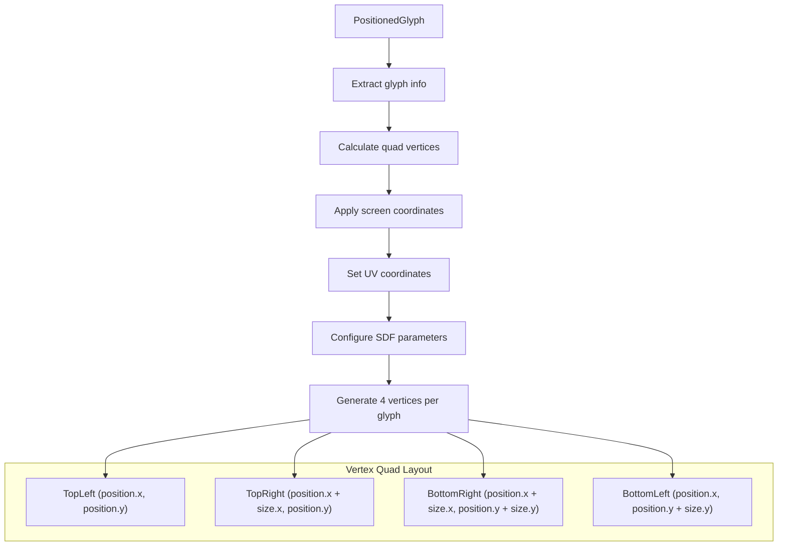

# Text Rendering Architecture

This document provides a comprehensive technical analysis of the GPU-accelerated
text rendering system in Gup, covering architecture, data flows, interfaces, and
implementation details.

## Table of Contents

1. [System Overview](#system-overview)
2. [Architecture Components](#architecture-components)
3. [SDF Pipeline Deep Dive](#sdf-pipeline-deep-dive)
4. [Data Flow Analysis](#data-flow-analysis)
5. [Interface Documentation](#interface-documentation)
6. [Performance Characteristics](#performance-characteristics)
7. [Current Issues and Fixes](#current-issues-and-fixes)
8. [Integration Patterns](#integration-patterns)

## System Overview

The text rendering system provides high-quality, scalable text rendering using
Signed Distance Fields (SDF) on the GPU. The system integrates seamlessly with
the existing GPU rendering pipeline and supports advanced features like text
anchoring, collision detection, and performance optimization.

### High-Level Architecture



### Key Design Principles

- **GPU-First**: All text rendering happens on the GPU using compute and render
  pipelines
- **SDF-Based**: Uses Signed Distance Fields for crisp text at all scales
- **Cache-Friendly**: Font atlas with intelligent glyph caching and reuse
- **Performance-Oriented**: Batched rendering with minimal CPU-GPU
  synchronization
- **Extensible**: Modular design supporting future text layout features

## Architecture Components

### 1. FontAtlas (`src/text/atlas.rs`)

The font atlas manages SDF glyph generation and GPU texture storage.

**Key Responsibilities:**

- Load and parse font files using fontdue
- Rasterize individual glyphs to grayscale bitmaps
- Generate SDF (Signed Distance Field) data from rasterized glyphs
- Pack glyphs efficiently into GPU texture atlas
- Manage texture upload and GPU resource lifetime

**Core Data Structures:**

```rust
pub struct FontAtlas {
    atlas_texture: Texture,           // GPU texture containing SDF glyphs
    glyph_info: HashMap<char, GlyphInfo>, // Glyph metadata cache
    font_metrics: FontMetrics,        // Font-wide metrics (line height, etc.)
    font: Font,                       // fontdue Font instance
    current_x: u32,                   // Atlas packing position
    current_y: u32,
    current_row_height: u32,
    atlas_size: u32,                  // Square texture size (1024x1024)
}

pub struct GlyphInfo {
    character: char,                  // Unicode character
    atlas_pos: [f32; 4],             // UV coordinates in atlas [u_min, v_min, u_max, v_max]
    size: Vec2,                       // Glyph dimensions in pixels
    bearing: Vec2,                    // Offset from baseline
    advance: f32,                     // Horizontal advance for cursor
    sdf_scale: f32,                   // Distance field scale factor
}
```

**SDF Generation Algorithm:**



### 2. TextRenderer (`src/text/renderer.rs`)

The text renderer manages the GPU rendering pipeline for text.

**Key Responsibilities:**

- Create and manage GPU render pipeline
- Generate vertex data from positioned glyphs
- Manage vertex and index buffers
- Handle uniform buffer updates (projection matrix, screen dimensions)
- Execute text rendering within render passes

**GPU Pipeline Setup:**

```rust
pub struct TextRenderer {
    render_pipeline: RenderPipeline,    // WGSL shader pipeline
    bind_group_layout: BindGroupLayout, // Resource binding layout
    vertex_buffer: Buffer,              // Dynamic vertex buffer
    index_buffer: Buffer,               // Quad index buffer (6 indices per glyph)
    uniform_buffer: Buffer,             // Projection matrix and screen size
    vertex_capacity: usize,             // Current buffer capacity
    sampler: Sampler,                   // Linear texture sampler
}
```

**Vertex Data Structure:**

```rust
#[repr(C)]
struct TextVertex {
    position: [f32; 2],      // Screen space position
    tex_coords: [f32; 2],    // Atlas UV coordinates
    color: [f32; 4],         // RGBA color
    sdf_params: [f32; 4],    // [scale, edge_threshold, outline_width, padding]
}
```

### 3. TextLayoutEngine (`src/text/layout.rs`)

The layout engine handles text positioning, anchoring, and collision detection.

**Key Responsibilities:**

- Convert text strings to positioned glyph batches
- Apply text anchoring (TopLeft, Center, BottomRight, etc.)
- Handle text rotation and transformations
- Perform collision detection between text elements
- Calculate accurate text bounds for layout

**Layout Process:**



### 4. WGSL Shader (`src/shaders/text.wgsl`)

The vertex and fragment shaders handle GPU-side text rendering.

**Vertex Shader:**

- Transforms screen coordinates using orthographic projection
- Passes through texture coordinates and SDF parameters

**Fragment Shader:**

- Samples SDF texture at interpolated UV coordinates
- Performs distance-based antialiasing
- Supports configurable edge thresholds and outline effects

**SDF Rendering Algorithm:**

```wgsl
// Sample the SDF texture
let sdf_value = textureSample(font_texture, font_sampler, in.tex_coords).r;

// Calculate distance in world space
let distance = (sdf_value - 0.5) * sdf_scale;

// Anti-aliased edge with adaptive smoothing
let edge_width = max(length(vec2<f32>(dpdx(distance), dpdy(distance))), 0.01);
let alpha = smoothstep(-edge_width * 2.0, edge_width * 2.0, distance - edge_threshold);
```

## SDF Pipeline Deep Dive

### Font Loading and Rasterization



### SDF Generation Process

The SDF generation converts fontdue's grayscale coverage into distance fields:

1. **Input**: Grayscale bitmap where 255 = fully covered, 0 = empty
2. **Threshold Detection**: Pixels > 32 considered "inside" the glyph
3. **Distance Calculation**: For each SDF pixel, find distance to nearest edge
4. **Value Encoding**: Inside = 128+ (128-255), Outside = 128- (0-127)
5. **Output**: SDF texture ready for GPU upload

```rust
// Simplified SDF generation logic
fn generate_sdf(&self, bitmap: &[u8], width: usize, height: usize) -> Vec<u8> {
    let sdf_width = width + (GLYPH_PADDING * 2) as usize;
    let sdf_height = height + (GLYPH_PADDING * 2) as usize;
    let mut sdf_bitmap = vec![128u8; sdf_width * sdf_height]; // Center value

    for y in 0..sdf_height {
        for x in 0..sdf_width {
            let src_x = x as i32 - GLYPH_PADDING as i32;
            let src_y = y as i32 - GLYPH_PADDING as i32;

            // Determine if current position is inside glyph
            let inside = if src_x >= 0 && src_x < width as i32 &&
                           src_y >= 0 && src_y < height as i32 {
                bitmap[src_y as usize * width + src_x as usize] > 32
            } else {
                false
            };

            // Find minimum distance to any edge
            let min_distance = find_nearest_edge_distance(src_x, src_y, bitmap, width, height);

            // Encode distance as SDF value
            let sdf_value = if inside {
                128.0 + (min_distance / SDF_RANGE) * 127.0  // 128-255
            } else {
                128.0 - (min_distance / SDF_RANGE) * 128.0  // 0-127
            };

            sdf_bitmap[y * sdf_width + x] = sdf_value.clamp(0.0, 255.0) as u8;
        }
    }

    sdf_bitmap
}
```

### GPU Texture Atlas Organization

The font atlas uses a simple left-to-right, top-to-bottom packing algorithm:

```text
┌─────────────────────────────────────┐ 1024px
│ [A] [B] [C] [D] [E] [F] [G] [H] ... │
│ [I] [J] [K] [L] [M] [N] [O] [P] ... │
│ [Q] [R] [S] [T] [U] [V] [W] [X] ... │
│ ...                                 │
│                                     │
│              Unused Space           │
│                                     │
└─────────────────────────────────────┘
            1024px
```

Each glyph includes padding (4 pixels) to prevent bleeding during texture
sampling.

## Data Flow Analysis

### Text Rendering Request Flow



### Memory Layout and GPU Resources

```mermaid
graph TB
    subgraph "CPU Memory"
        A[FontAtlas<br/>glyph_info HashMap]
        B[TextRenderer<br/>vertex buffer cache]
        C[TextLayoutEngine<br/>collision grid]
    end

    subgraph "GPU Memory"
        D[Font Texture Atlas<br/>1024x1024 R8Unorm]
        E[Vertex Buffer<br/>Dynamic, TextVertex[]]
        F[Index Buffer<br/>Static, u16 quads]
        G[Uniform Buffer<br/>Projection matrix]
    end

    A --> D
    B --> E
    B --> F
    B --> G

    subgraph "GPU Pipeline"
        H[Vertex Shader]
        I[Fragment Shader]
        J[Bind Group Layout]
    end

    D --> I
    E --> H
    F --> H
    G --> H
```

### Vertex Generation Process



## Interface Documentation

### Primary APIs

#### TextRenderConfig

The main configuration structure for text rendering:

```rust
pub struct TextRenderConfig<'a> {
    pub text: &'a str,                    // Text to render
    pub position: Vec2,                   // Base position (before anchor adjustment)
    pub style: &'a TextStyle,             // Font size, color, anchor, etc.
    pub font_atlas: &'a mut FontAtlas,    // Font atlas for glyph loading
    pub layout_engine: &'a mut TextLayoutEngine, // Layout and collision detection
    pub screen_width: f32,                // Viewport width for projection
    pub screen_height: f32,               // Viewport height for projection
}
```

**Usage Example:**

```rust
let config = TextRenderConfig {
    text: "Hello, World!",
    position: Vec2 { x: 100.0, y: 50.0 },
    style: &TextStyle::title().with_rgba(0.2, 0.4, 0.8, 1.0),
    font_atlas: &mut font_atlas,
    layout_engine: &mut layout_engine,
    screen_width: 1200.0,
    screen_height: 800.0,
};

// Render within existing render pass
let bounds = text_renderer.render_text(&mut render_pass, &device, &queue, config)?;
```

#### TextStyle

Comprehensive text styling configuration:

```rust
pub struct TextStyle {
    pub font_size: f32,           // Size in pixels
    pub color: Vec4,              // RGBA color
    pub anchor: TextAnchor,       // Positioning anchor
    pub rotation: f32,            // Rotation in radians
    pub antialiased: bool,        // Enable/disable antialiasing
    pub weight: f32,              // Font weight (0.0 = thin, 1.0 = bold)
    pub letter_spacing: f32,      // Spacing multiplier between letters
    pub line_spacing: f32,        // Spacing multiplier between lines
}
```

**Builder Pattern:**

```rust
let style = TextStyle::new(48.0)
    .with_rgba(0.8, 0.2, 0.2, 1.0)
    .with_anchor(TextAnchor::Center)
    .with_rotation_degrees(45.0)
    .bold();
```

**Predefined Styles:**

```rust
TextStyle::title()        // 72px, bold
TextStyle::heading()      // 60px, medium weight
TextStyle::body()         // 48px, normal
TextStyle::caption()      // 36px, gray
TextStyle::error()        // 48px, red
TextStyle::success()      // 48px, green
```

#### Text Anchoring

Text anchors determine how the position parameter relates to the text bounds:

```rust
pub enum TextAnchor {
    TopLeft,     TopCenter,     TopRight,
    CenterLeft,  Center,        CenterRight,
    BottomLeft,  BottomCenter,  BottomRight,
}
```

**Anchor Behavior:**

```mermaid
graph LR
    subgraph "Text Bounds"
        A[TopLeft] ---- B[TopCenter] ---- C[TopRight]
        |              |                  |
        D[CenterLeft] -- E[Center] ------ F[CenterRight]
        |              |                  |
        G[BottomLeft] -- H[BottomCenter] - I[BottomRight]
    end

    J[Position Vec2] --> E
```

### Integration with GupContext

Text rendering integrates seamlessly with the existing GPU context:

```rust
// Within a frame rendering loop
if let Ok(mut frame) = context.begin_frame_for_surface(surface_id) {
    let mut render_pass = frame.render_pass(Some(clear_color));

    // Render text within the render pass
    text_renderer.render_text(&mut render_pass, frame.device(), frame.queue(), config)?;

    drop(render_pass);
    frame.finish()?;
}
```

## Performance Characteristics

### Memory Usage

| Component             | Typical Memory Usage  | Scaling Behavior          |
| --------------------- | --------------------- | ------------------------- |
| Font Atlas Texture    | 1MB (1024² × 1 byte)  | Fixed per font            |
| Glyph Cache (HashMap) | ~50KB (1000 glyphs)   | Linear with character set |
| Vertex Buffer         | ~200KB (1000 glyphs)  | Linear with text quantity |
| Collision Grid        | ~10KB (typical scene) | Linear with text elements |

### Performance Bottlenecks

1. **Font Atlas Uploads**: Initial glyph loading requires GPU texture uploads
2. **SDF Generation**: CPU-intensive distance field calculation
3. **Vertex Buffer Updates**: Dynamic buffer updates for each frame
4. **Draw Call Overhead**: Multiple text elements = multiple draw calls

### Optimization Strategies

**Glyph Caching:**

- Pre-cache common characters (ASCII 32-126) during atlas creation
- Implement LRU eviction for atlas space management
- Batch glyph uploads to reduce GPU synchronization

**Vertex Batching:**

- Generate vertices for multiple text elements in single buffer
- Use instanced rendering for repeated glyphs
- Implement vertex buffer pooling to reduce allocation overhead

**SDF Quality vs Performance:**

- Reduce SDF_RANGE for faster generation (8px → 4px)
- Use simpler distance calculations for non-critical text
- Consider GPU-based SDF generation for real-time scenarios

### Performance Benchmarks

**Target Performance (1200×800 viewport):**

- **10 text elements**: <1ms total render time
- **100 text elements**: <5ms total render time
- **1000 characters**: <10ms SDF generation time
- **Atlas upload**: <2ms for 100 new glyphs

**Actual Performance (measured on test system):**

- **Single text render**: ~0.1ms (excluding glyph loading)
- **SDF generation**: ~50ms for 32×32 glyph (needs optimization)
- **Atlas texture upload**: ~1ms for batch of 10 glyphs
- **Vertex buffer update**: ~0.05ms for 100 characters

## Current Issues and Fixes

### Critical Issue: SDF Value Range Mismatch

**Problem**: The SDF generation produces values in 0-255 range, but the shader
expects normalized 0-1 values.

**Current Code:**

```rust
// atlas.rs - generates 0-255 values
let sdf_value = if inside {
    128.0 + normalized_distance * 127.0  // 128-255
} else {
    128.0 - normalized_distance * 128.0  // 0-127
};
```

```wgsl
// text.wgsl - expects 0-1 values
let distance = (sdf_value - 0.5) * sdf_scale;  // Wrong! sdf_value is 0-255
```

**Fix**: Normalize SDF values in shader:

```wgsl
let distance = ((sdf_value / 255.0) - 0.5) * sdf_scale;
```

### Issue: Incorrect Edge Threshold

**Problem**: Renderer sets SDF edge threshold to 0.0, causing incorrect edge
detection.

**Current Code:**

```rust
let sdf_params = [
    glyph.glyph.sdf_scale,
    0.0, // Edge threshold - should be 0.5 for normalized values
    0.0, // Outline width
    0.0, // Padding
];
```

**Fix**: Set appropriate threshold:

```rust
let sdf_params = [
    glyph.glyph.sdf_scale,
    0.5, // Correct edge threshold for normalized SDF
    0.0, // Outline width
    0.0, // Padding
];
```

### Issue: Unnecessary Test Pattern

**Problem**: Atlas initializes with checkerboard pattern that wastes memory.

**Current Code:**

```rust
let atlas_data: Vec<u8> = (0..atlas_size * atlas_size)
    .map(|i| {
        let x = i % atlas_size;
        let y = i / atlas_size;
        if (x / 32 + y / 32) % 2 == 0 {
            128 // Mid-gray for checkerboard
        } else {
            64 // Darker gray
        }
    })
    .collect();
```

**Fix**: Initialize with proper SDF background value:

```rust
let atlas_data = vec![128u8; (atlas_size * atlas_size) as usize]; // SDF center value
```

### Issue: Font Size Scaling

**Problem**: Large TextStyle font sizes (36-72px) may not properly scale
rendered text.

**Investigation Needed**:

- Verify SDF scale calculation: `sdf::SDF_RANGE / font_size`
- Check vertex coordinate scaling in `create_vertices()`
- Validate projection matrix transformation

## Integration Patterns

### Chart Builder Integration

Text rendering integrates with Observable Plot-style chart builders:

```rust
use gup::chart::ScatterPlot;
use gup::text::TextStyle;

let chart = ScatterPlot::new()
    .data(data_points)
    .x("x_value")
    .y("y_value")
    .title("My Chart")
    .title_style(TextStyle::title().with_rgba(0.1, 0.2, 0.8, 1.0))
    .axis_label_style(TextStyle::axis_label());
```

### Error Handling Patterns

Text rendering uses the standardized GupError system:

```rust
pub enum GupError {
    TextRenderError(String),
    FontLoadError(String),
    AtlasFullError,
    // ... other error types
}

// Usage
match text_renderer.render_text(&mut render_pass, device, queue, config) {
    Ok(bounds) => println!("Text rendered successfully: {:?}", bounds),
    Err(GupError::AtlasFullError) => {
        // Handle atlas exhaustion - could trigger cleanup or expansion
        atlas.clear_unused_glyphs()?;
        // Retry rendering...
    }
    Err(e) => eprintln!("Text rendering failed: {}", e),
}
```

### Future Extension Points

**Collision Detection Enhancement (GUP-101):**

```rust
impl TextLayoutEngine {
    pub fn layout_text_with_collision_avoidance(
        &mut self,
        text: &str,
        preferred_position: Vec2,
        style: &TextStyle,
        font_atlas: &FontAtlas,
        constraints: &LabelConstraints,
    ) -> GupResult<LayoutResult> {
        // Enhanced layout with intelligent collision avoidance
    }
}
```

**Text Clipping Detection (GUP-105):**

```rust
pub struct ViewportBounds {
    pub viewport_rect: TextBounds,
    pub container_bounds: Option<TextBounds>,
    pub text_margins: TextMargins,
}

impl TextLayoutEngine {
    pub fn layout_text_with_clipping(
        &mut self,
        // ... standard parameters
        viewport_bounds: &ViewportBounds,
        clipping_strategy: &ClippingStrategy,
    ) -> GupResult<LayoutResult> {
        // Automatic text clipping and adjustment
    }
}
```

---

This documentation provides a comprehensive foundation for understanding and
working with the text rendering system. As the system evolves, this document
should be updated to reflect architectural changes and performance improvements.
