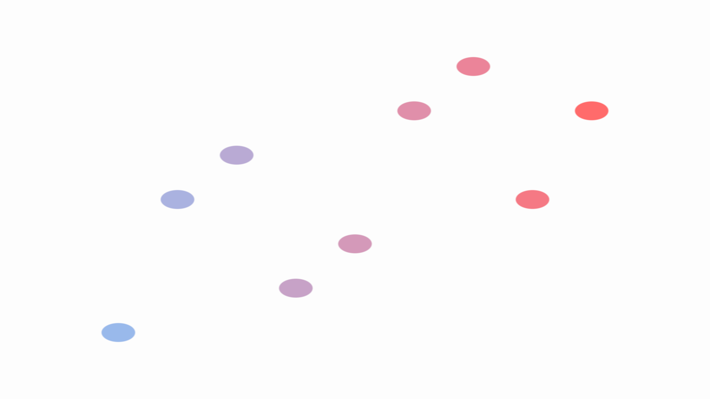

# Tutorial 1: Getting Started

> **Goal**: Create a GPU-accelerated scatter chart, render it, and run the
> program — all in under 50 lines of Rust.

## What You Will Learn

- How to add Gup as a dependency
- How to define a data structure for your chart
- How to create accessor functions that map data fields to visual properties
- How to use the `scatter()` chart builder API
- How to run your first Gup program

## Step 1: Set Up Your Project

Create a new Rust project and add Gup as a dependency:

```bash
cargo new my-first-chart
cd my-first-chart
```

Add the following to your `Cargo.toml`:

```toml
[package]
name = "my-first-chart"
version = "0.1.0"
edition = "2024"

[dependencies]
gup = { path = "../gup" }   # adjust the path to your local Gup checkout
tokio = { version = "1", features = ["full"] }
```

> **Note**: Gup is not yet published on crates.io. Use a `path` or `git`
> dependency pointing at your local checkout or the repository URL.

## Step 2: Define Your Data

Every Gup chart starts with a Rust struct that represents one data point.
The struct needs `Debug` and `Clone`:

```rust
#[derive(Debug, Clone)]
struct Point {
    x: f32,
    y: f32,
}
```

Then create a `Vec` of your data:

```rust
let data = vec![
    Point { x: 1.0, y: 2.0 },
    Point { x: 2.0, y: 4.0 },
    Point { x: 3.0, y: 3.0 },
    Point { x: 4.0, y: 5.0 },
    Point { x: 5.0, y: 4.5 },
];
```

## Step 3: Initialise the GPU Context

Gup renders on the GPU. The `RenderContext` is the bridge between your Rust code
and the graphics hardware:

```rust
use gup::prelude::*;
use std::sync::Arc;

let context = Arc::new(RenderContext::new().await?);
```

`RenderContext::new()` is async because it negotiates with the GPU driver. Wrap
your `main` function with `#[tokio::main]` so you can `await` it.

## Step 4: Create Accessor Functions

Accessors tell Gup how to extract values from your data struct. An
`AccessorFunction` wraps a closure that maps `&T` → `AccessorValue`:

```rust
let x_accessor = AccessorFunction::new(
    |point: &Point| AccessorValue::Float(point.x),
);
let y_accessor = AccessorFunction::new(
    |point: &Point| AccessorValue::Float(point.y),
);
```

`AccessorValue::Float` is the most common variant. Gup also supports
`AccessorValue::Color([f32; 4])` for RGBA colours and
`AccessorValue::Vec2([f32; 2])` for 2D positions.

## Step 5: Build the Scatter Chart

The `scatter()` function returns a `ScatterPlotBuilder`. Chain configuration
methods to set the x accessor, y accessor, title, point size, and fill colour:

```rust
let chart = scatter()
    .x(x_accessor)
    .y(y_accessor)
    .title("Hello Gup!")
    .point_size(10.0)
    .fill_color([0.2, 0.6, 0.9, 1.0]);
```

Finally, build the chart with your data and GPU context:

```rust
let selection = chart.build_with_data(data, context)?;
```

The returned `selection` is a GPU-backed `Selection` ready for rendering. You
can query it to confirm everything worked:

```rust
println!("Created a scatter plot with {} points", selection.len());
```

## Full Program

Here is the complete program. Save it as `src/main.rs`:

```rust
use gup::prelude::*;
use std::sync::Arc;

#[derive(Debug, Clone)]
struct Point {
    x: f32,
    y: f32,
}

#[tokio::main]
async fn main() -> GupResult<()> {
    let data = vec![
        Point { x: 1.0, y: 2.0 },
        Point { x: 2.0, y: 4.0 },
        Point { x: 3.0, y: 3.0 },
        Point { x: 4.0, y: 5.0 },
        Point { x: 5.0, y: 4.5 },
    ];

    let context = Arc::new(RenderContext::new().await?);

    let x_accessor = AccessorFunction::new(
        |point: &Point| AccessorValue::Float(point.x),
    );
    let y_accessor = AccessorFunction::new(
        |point: &Point| AccessorValue::Float(point.y),
    );

    let chart = scatter()
        .x(x_accessor)
        .y(y_accessor)
        .title("Hello Gup!")
        .point_size(10.0)
        .fill_color([0.2, 0.6, 0.9, 1.0]);

    let selection = chart.build_with_data(data, context)?;

    println!("Hello Gup!");
    println!("Created a scatter plot with {} points", selection.len());

    Ok(())
}
```

Run it:

```bash
cargo run
```

You should see:

```text
Hello Gup!
Created a scatter plot with 5 points
```

Congratulations — you have created your first GPU-accelerated chart! The
`selection` is ready to be rendered to a window or exported.



## Other Chart Types

Gup ships builders for several chart types. They all follow the same pattern:

```rust
// Line chart
let chart = line()
    .x(x_accessor)
    .y(y_accessor)
    .stroke_color([0.2, 0.6, 1.0, 1.0])
    .stroke_width_px(2.0);

// Bar chart
let chart = bar()
    .x(x_accessor)
    .y(y_accessor)
    .vertical();

// Area chart
let chart = area()
    .x(x_accessor)
    .y(y_accessor);
```

You can also use the `plot()` entry point for a more declarative style:

```rust
let builder = plot()
    .data(data)
    .scatter(x_field, y_field);
```

<!-- TODO(GUP-280): See the `PlotBuilder` API reference for the full list of
     builder methods and configuration options. -->

## Next Steps

- **[Tutorial 2: Data Binding](02_data_binding.md)** — learn how `Selection<T,
  M>` works under the hood and bind complex data structures.
- **[`02_scatter_window` example](../../examples/basic/02_scatter_window.rs)** —
  display a scatter chart in an interactive window.
- **[Grid System guide](../GRID_SYSTEM.md)** — add grid lines and axes to your
  charts.
