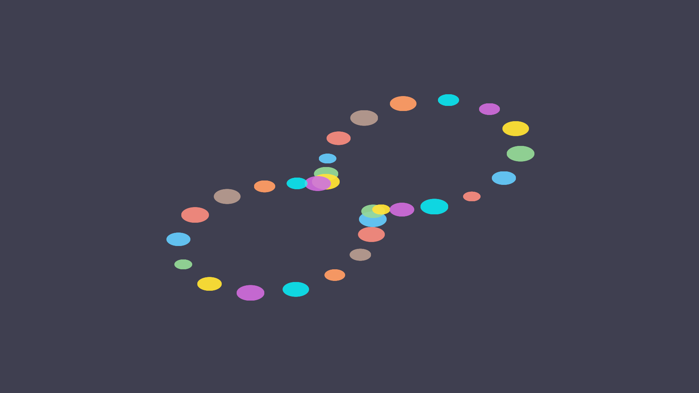

# Tutorial 4: Interactions

> **Goal**: Add hover, click, brush, and zoom/pan interactions to a scatter
> chart.

## What You Will Learn

- How Gup's interaction event system works
- How to register click, hover, and drag handlers on a `Selection`
- How to add a tooltip on hover
- How to wire up brush selection for multi-element picking
- How to enable zoom and pan with `ZoomBehavior`

## Prerequisites

Complete [Tutorial 2](02_data_binding.md). Familiarity with `Selection<T, M>`
and `.attr()` is assumed.

## The Interaction Model

Gup uses a **behaviour-based** interaction model. You attach lightweight
behaviour objects (like `ZoomBehavior` or `BrushBehavior`) that consume raw
input events and produce high-level interaction state. The `Selection` type also
provides convenience methods for the most common patterns.

The core type is `InteractionEvent`:

```rust,ignore
pub struct InteractionEvent {
    pub interaction_type: String,
    pub screen_position: Vec2,
    pub world_position: Option<Vec2>,
    pub hit: Option<ElementHit>,
    pub metadata: HashMap<String, String>,
    pub modifiers: ModifierFlags,
    // …
}
```

Every interaction handler receives a mutable reference to an `InteractionEvent`
and a reference to the data element that was interacted with.

## Step 1: Register Click Handlers

Use `.on_click()` on a selection to run code when an element is clicked:

```rust,ignore
use gup::prelude::*;

#[derive(Debug, Clone)]
struct City {
    name: String,
    population: f32,
    x: f32,
    y: f32,
}

let mut selection = Selection::<City, Circle>::from_data(cities);

selection
    .attr("center", |d: &City| [d.x, d.y])
    .attr("radius", |d: &City| 0.01 + d.population / 1e7)
    .on_click(|_event, city| {
        println!("Clicked: {} (pop. {:.0})", city.name, city.population);
    });
```

The handler fires when a hit test determines that the click landed on a circle
belonging to this selection. Gup performs hit testing on the GPU using compute
shaders, so it scales to millions of elements.

## Step 2: Register Hover Handlers

Use `.on_hover()` to respond when the pointer enters an element:

```rust,ignore
selection.on_hover(|event, city| {
    println!(
        "Hovering over {} at screen ({:.0}, {:.0})",
        city.name,
        event.screen_position.x,
        event.screen_position.y,
    );
});
```

### Adding a Tooltip

For tooltip display, combine hover detection with Gup's `HoverRevealState`:

```rust,ignore
use gup::prelude::*;

// Configure the tooltip
let tooltip_config = TooltipConfig {
    show_delay: 0.3,        // seconds before tooltip appears
    fade_in_duration: 0.15,
    fade_out_duration: 0.1,
    font_size: 13.0,
    corner_radius: 4.0,
    ..Default::default()
};

let mut hover_state = HoverRevealState::new(tooltip_config);
```

In your render loop, update the hover state each frame with the current mouse
position and delta time:

```rust,ignore
// Each frame:
hover_state.update(&clipped_text_registry, mouse_x, mouse_y, dt);

if let Some(tooltip) = hover_state.active_tooltip() {
    // Render the tooltip text and background
    // See the hover_reveal_demo example for full rendering code
}
```



## Step 3: Register Drag Handlers

Use `.on_drag()` for drag-based interactions:

```rust,ignore
selection.on_drag(|event, city| {
    println!(
        "Dragging {} to ({:.2}, {:.2})",
        city.name,
        event.screen_position.x,
        event.screen_position.y,
    );
});
```

## Step 4: Generic Event Handler

For events beyond the convenience methods, use `.on()` with an event type
string:

```rust,ignore
selection.on("mouseenter", |event, city| {
    println!("Mouse entered {}", city.name);
    event.stop_propagation(); // Prevent the event from bubbling
});
```

Common event type strings: `"click"`, `"mouseenter"`, `"mouseleave"`,
`"mousemove"`, `"dragstart"`, `"dragmove"`, `"dragend"`.

## Step 5: Brush Selection

Brush selection lets users drag a rectangle to select multiple elements. Use
`BrushBehavior`:

```rust,ignore
use gup::prelude::*;

let mut brush = BrushBehavior::new()
    .style(BrushStyle::default());
```

Wire the brush to pointer events in your event loop:

```rust,ignore
// On mouse down:
brush.on_pointer_down(Vec2::new(mouse_x, mouse_y));

// On mouse move (while dragging):
brush.on_pointer_move(
    Vec2::new(mouse_x, mouse_y),
    &viewport_transform,
    Some(&mark_selection_system),
);

// On mouse up:
brush.on_pointer_up(
    Vec2::new(mouse_x, mouse_y),
    &viewport_transform,
    Some(&mark_selection_system),
);
```

The `mark_selection_system` provides hit testing against your marks. Set it up
with the positions of your data points:

```rust,ignore
let mut mark_system = MarkSelectionSystem::new(data.len());
mark_system.set_positions(positions);
```

When the brush completes, it returns a `BrushEvent` containing the indices of
selected elements.

## Step 6: Zoom and Pan

`ZoomBehavior` provides smooth zoom and pan with inertia. Create one and
configure its constraints:

```rust,ignore
use gup::prelude::*;

let mut zoom = ZoomBehavior::new()
    .scale_extent(0.1, 100.0)    // min/max zoom level
    .inertia_decay(0.85);         // momentum decay rate (0–1)
```

Wire input events to the zoom behaviour:

```rust,ignore
// Mouse wheel → zoom
zoom.on_wheel(wheel_delta_y, mouse_x, mouse_y);

// Mouse drag → pan
zoom.on_drag_start(mouse_x, mouse_y);
zoom.on_drag_move(mouse_x, mouse_y);
zoom.on_drag_end();
```

Each frame, call `tick()` to advance the inertia simulation, then read the GPU
transform:

```rust,ignore
// In your render loop:
zoom.tick();

let transform = zoom.gpu_transform();
// transform.scale_x, transform.scale_y, transform.translate_x, transform.translate_y
```

Upload the transform to your shader as a uniform so the GPU applies zoom/pan to
all rendered marks:

```rust,ignore
queue.write_buffer(&viewport_buffer, 0, bytemuck::bytes_of(&transform));
```

### Querying Zoom State

```rust,ignore
if zoom.is_dragging() {
    // User is actively panning
}
if zoom.is_animating() {
    // Inertia is still decaying — keep rendering
}
let current_scale = zoom.scale(); // e.g. 2.5 = zoomed in 2.5×
```

### Resetting

```rust,ignore
zoom.reset(); // Return to default scale and position
```

## Combining Interactions

All interaction patterns compose naturally. A single selection can have click,
hover, drag, and zoom handlers simultaneously:

```rust,ignore
selection
    .attr("center", |d: &City| [d.x, d.y])
    .attr("radius", |_d: &City| 0.03)
    .on_click(|_event, city| {
        println!("Selected: {}", city.name);
    })
    .on_hover(|_event, city| {
        println!("Tooltip: {}", city.name);
    });
```

The zoom behaviour operates at the viewport level and is independent of
per-element handlers.

## Full Example

```rust,no_run
use gup::prelude::*;
use std::sync::Arc;

#[derive(Debug, Clone)]
struct DataPoint {
    x: f32,
    y: f32,
    label: String,
}

#[tokio::main]
async fn main() -> GupResult<()> {
    let data = vec![
        DataPoint { x: 0.2, y: 0.3, label: "A".into() },
        DataPoint { x: 0.5, y: 0.8, label: "B".into() },
        DataPoint { x: 0.8, y: 0.4, label: "C".into() },
    ];

    let context = Arc::new(RenderContext::new().await?);

    let mut selection = Selection::<DataPoint, Circle>::from_data(data);
    selection
        .attr("center", |d: &DataPoint| [d.x * 2.0 - 1.0, d.y * 2.0 - 1.0])
        .attr("radius", |_d: &DataPoint| 0.05)
        .attr("fill_color", |_d: &DataPoint| [0.2, 0.6, 0.9, 0.8])
        .on_click(|_event, d| println!("Clicked: {}", d.label))
        .on_hover(|_event, d| println!("Hover: {}", d.label));

    // Set up zoom
    let zoom = ZoomBehavior::new()
        .scale_extent(0.5, 20.0)
        .inertia_decay(0.9);

    println!("Interactive scatter plot ready ({} points)", selection.len());
    println!("Zoom scale extent: 0.5× to 20×");
    println!("Current zoom: {:.1}×", zoom.scale());

    Ok(())
}
```

## Key Concepts

| Concept                   | What It Does                                          |
| ------------------------- | ----------------------------------------------------- |
| `on_click(handler)`       | Fires when an element is clicked                      |
| `on_hover(handler)`       | Fires when the pointer enters an element              |
| `on_drag(handler)`        | Fires during a drag interaction                       |
| `on(event_type, handler)` | Generic event registration                            |
| `ZoomBehavior`            | Smooth zoom/pan with inertia and constraints          |
| `BrushBehavior`           | Rectangle brush selection for multi-element picking   |
| `HoverRevealState`        | Tooltip display with configurable delay and animation |

## Next Steps

- **[Tutorial 5: Streaming Data](05_streaming_data.md)** — connect live data
  sources to your charts.
- **[`tutorial04_interactions` example](../../examples/tutorials/tutorial04_interactions.rs)**
  — run exactly this tutorial's interactive chart in a window.
- **[`interactive_circles` example](../../examples/interactive_circles.rs)** —
  full windowed example with click and hover handlers.
- **[`zoom_pan` example](../../examples/zoom_pan.rs)** — complete zoom/pan
  implementation with inertia.
- **[`brush_selection` example](../../examples/brush_selection.rs)** — brush
  selection with visual feedback.
