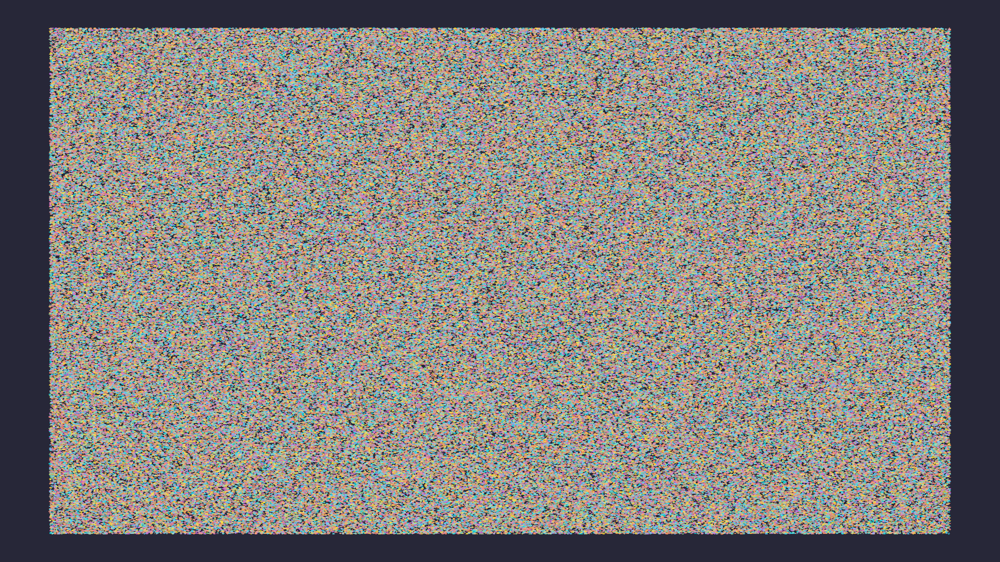

# Tutorial 5: Streaming Data

> **Goal**: Connect a live data source to a Gup chart using
> `StreamingDataSource` and `DataStream`.

## What You Will Learn

- The difference between `StreamingDataSource` and `DataStream`
- How to implement a `StreamingDataSource` that generates synthetic data
- How to use the `DataStream` builder API for GPU-backed streaming
- Backpressure strategies and eviction semantics
- How to wire a stream to a `Selection` for live updates

## Prerequisites

Complete [Tutorial 2](02_data_binding.md). You should be comfortable with
`Selection<T, M>` and data binding.

## Two Streaming Approaches

Gup offers two complementary APIs for streaming data:

| API                      | Level   | Best For                                             |
| ------------------------ | ------- | ---------------------------------------------------- |
| `StreamingDataSource<T>` | Trait   | Custom data sources (sensors, WebSockets, databases) |
| `DataStream<T>`          | Builder | GPU-backed ring buffers with backpressure            |

`StreamingDataSource` is an async trait you implement to produce batches of
data. `DataStream` is a concrete, GPU-optimised stream that manages a fixed-
capacity buffer on the GPU. You can use either or both together.

## Approach 1: Implement `StreamingDataSource`

The `StreamingDataSource<T>` trait has five methods:

```rust
use gup::prelude::*;
use async_trait::async_trait;

#[async_trait]
pub trait StreamingDataSource<T>: MaybeSend + MaybeSync {
    /// Produce the next batch of data, or None when the stream is exhausted.
    async fn next_batch(&mut self) -> Option<GupResult<Vec<T>>>;

    /// Returns true if more data is expected.
    fn has_more(&self) -> bool;

    /// Returns statistics about the stream (items processed, bytes, etc.).
    fn stream_stats(&self) -> StreamStats;

    /// Set the number of items to request per batch.
    fn set_batch_size(&mut self, size: usize);

    /// Get the current batch size.
    fn batch_size(&self) -> usize;
}
```

### Minimal Implementation

Here is a synthetic data source that generates random points:

```rust
use gup::async_mixable::streaming::{Point2D, StreamStats, StreamingDataSource};
use gup::error::GupResult;
use async_trait::async_trait;

pub struct SyntheticSource {
    remaining: usize,
    batch_size: usize,
    produced: usize,
}

impl SyntheticSource {
    pub fn new(total_points: usize) -> Self {
        Self {
            remaining: total_points,
            batch_size: 100,
            produced: 0,
        }
    }
}

#[async_trait]
impl StreamingDataSource<Point2D> for SyntheticSource {
    async fn next_batch(&mut self) -> Option<GupResult<Vec<Point2D>>> {
        if self.remaining == 0 {
            return None;
        }

        let count = self.batch_size.min(self.remaining);
        let batch: Vec<Point2D> = (0..count)
            .map(|i| {
                let t = (self.produced + i) as f32 / 1000.0;
                Point2D {
                    x: t,
                    y: (t * 6.28).sin() * 0.5 + 0.5,
                    color: [0.2, 0.6, 0.9, 0.8],
                }
            })
            .collect();

        self.remaining -= count;
        self.produced += count;
        Some(Ok(batch))
    }

    fn has_more(&self) -> bool {
        self.remaining > 0
    }

    fn stream_stats(&self) -> StreamStats {
        StreamStats::default()
    }

    fn set_batch_size(&mut self, size: usize) {
        self.batch_size = size;
    }

    fn batch_size(&self) -> usize {
        self.batch_size
    }
}
```

### Wire to `StreamingScatterPlot`

```rust
use gup::async_mixable::streaming::StreamingScatterPlot;

let source = SyntheticSource::new(5000);
let streaming_chart = StreamingScatterPlot::new(source, 2000);

// Check status
println!("Max points: {}", streaming_chart.max_points());
```

`StreamingScatterPlot` caps the displayed point count at `max_points`. When the
stream produces more, the oldest points are evicted.

## Approach 2: Use the `DataStream` Builder

For GPU-backed streaming with fine-grained control, use `DataStream`:

```rust
use gup::streaming::{DataStream, StreamMode, BackpressureStrategy};

let stream = DataStream::<[f32; 2]>::builder()
    .capacity(500)                                  // max 500 elements
    .mode(StreamMode::SlidingWindow)                // keep most recent
    .backpressure(BackpressureStrategy::EvictOldest) // evict when full
    .build(&device)
    .expect("valid stream configuration");
```

### Stream Modes

| Mode            | Behaviour                                                        |
| --------------- | ---------------------------------------------------------------- |
| `RingBuffer`    | Wraps around, overwriting the oldest slot (lowest overhead)      |
| `SlidingWindow` | Retains the most recent `capacity` items; oldest evicted on push |
| `AppendOnly`    | Appends until full; then applies backpressure strategy           |

### Backpressure Strategies

| Strategy      | Behaviour                                      |
| ------------- | ---------------------------------------------- |
| `EvictOldest` | Removes the oldest item to make room (default) |
| `DropNewest`  | Silently drops incoming data when full         |
| `Block`       | Blocks the producer until space is available   |

### Push Data and Flush to GPU

```rust
// Push individual items
stream.push([0.5, 0.3]);

// Push a batch
let batch = vec![[0.1, 0.2], [0.3, 0.4], [0.5, 0.6]];
let inserted = stream.push_batch(batch);
println!("{} items inserted", inserted);

// Flush pending data to the GPU buffer
let bytes_written = stream.flush(&device, &queue);
println!("{} bytes uploaded to GPU", bytes_written);
```

### Subscribe to Updates

```rust
let handle = stream.subscribe(|update| {
    println!("Stream update: {} new items", update.count);
});
```

### Wire to a Selection

Connect the stream to a `Selection` so it automatically feeds data into the
rendering pipeline:

```rust
let mut selection = Selection::<[f32; 2], Circle>::from_data(vec![]);
selection.stream(stream);
```

Now, whenever you push data to the stream and flush it, the selection's GPU
buffers are updated and the chart re-renders with the new data.

## Full Example

```rust
use gup::async_mixable::streaming::{Point2D, StreamingDataSource, StreamingScatterPlot};
use gup::error::GupResult;
use async_trait::async_trait;

struct SineWaveSource {
    step: usize,
    batch_size: usize,
}

impl SineWaveSource {
    fn new() -> Self {
        Self { step: 0, batch_size: 50 }
    }
}

#[async_trait]
impl StreamingDataSource<Point2D> for SineWaveSource {
    async fn next_batch(&mut self) -> Option<GupResult<Vec<Point2D>>> {
        let batch: Vec<Point2D> = (0..self.batch_size)
            .map(|i| {
                let t = (self.step + i) as f32 * 0.02;
                Point2D {
                    x: t % 2.0 - 1.0,
                    y: (t * 3.14).sin(),
                    color: [0.9, 0.4, 0.1, 0.8],
                }
            })
            .collect();
        self.step += self.batch_size;
        Some(Ok(batch))
    }

    fn has_more(&self) -> bool { true } // infinite stream
    fn stream_stats(&self) -> gup::async_mixable::streaming::StreamStats {
        gup::async_mixable::streaming::StreamStats::default()
    }
    fn set_batch_size(&mut self, size: usize) { self.batch_size = size; }
    fn batch_size(&self) -> usize { self.batch_size }
}

#[tokio::main]
async fn main() -> GupResult<()> {
    let source = SineWaveSource::new();
    let chart = StreamingScatterPlot::new(source, 1000);

    println!("Streaming scatter plot ready");
    println!("Max visible points: {}", chart.max_points());

    Ok(())
}
```



> **Note**: The ergonomic `DataStream` builder API is being further refined in a
> future story. The `StreamingDataSource` trait and `StreamingScatterPlot` shown
> here are stable and production-ready.
>
> <!-- TODO(GUP-280): Link to DataStream API reference when available -->

## Key Concepts

| Concept                   | What It Does                                     |
| ------------------------- | ------------------------------------------------ |
| `StreamingDataSource<T>`  | Async trait for custom data sources              |
| `StreamingScatterPlot`    | Capped scatter plot backed by a streaming source |
| `DataStream<T>`           | GPU-backed ring buffer with builder API          |
| `StreamMode`              | Controls how the buffer handles new data         |
| `BackpressureStrategy`    | Controls what happens when the buffer is full    |
| `push()` / `push_batch()` | Add data to the stream                           |
| `flush()`                 | Upload pending data to the GPU                   |

## Next Steps

- **[Tutorial 6: Custom Marks](06_custom_marks.md)** — implement a new mark type
  from scratch.
- **[`streaming_live_chart` example](../../examples/streaming_live_chart.rs)** —
  full windowed streaming chart with GPU rendering.
- **[`async_streaming_demo` example](../../examples/async_streaming_demo.rs)** —
  async streaming patterns.
