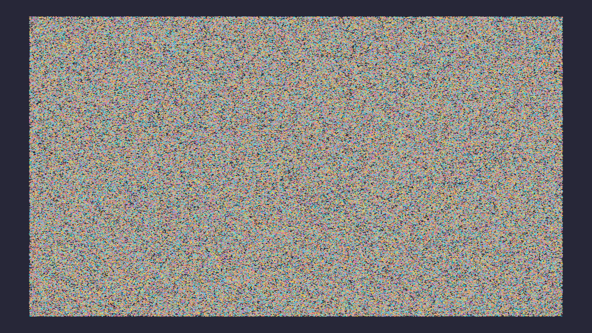

# Tutorial 5: Streaming Data

> **Goal**: Feed live data into a Gup chart using the GPU-backed `DataStream`.

## What You Will Learn

- How to build a `DataStream` with the fluent builder API
- Stream modes, backpressure strategies and eviction semantics
- How to push data, flush it to the GPU and subscribe to updates
- How to wire a stream to a `Selection` for live updates

## Prerequisites

Complete [Tutorial 2](02_data_binding.md). You should be comfortable with
`Selection<T, M>` and data binding.

## Build a `DataStream`

`DataStream<T>` is a fixed-capacity buffer that mirrors its contents to a GPU
buffer. `T` must be `bytemuck::Pod`, so plain arrays and `#[repr(C)]` structs
work:

```rust,ignore
use gup::streaming::{BackpressureStrategy, DataStream, StreamMode};

let mut stream = DataStream::<[f32; 2]>::builder()
    .capacity(1000)                                  // max 1000 elements
    .mode(StreamMode::SlidingWindow)                 // keep most recent
    .backpressure(BackpressureStrategy::EvictOldest) // evict when full
    .build(&device)
    .expect("valid stream configuration");
```

### Stream Modes

| Mode            | Behaviour                                                        |
| --------------- | ---------------------------------------------------------------- |
| `RingBuffer`    | Wraps around, overwriting the oldest slot (lowest overhead)      |
| `SlidingWindow` | Retains the most recent `capacity` items; oldest evicted on push |
| `AppendOnly`    | Appends until full; then applies backpressure strategy           |

### Backpressure Strategies

Backpressure applies to `AppendOnly` streams once they are full:

| Strategy      | Behaviour                                                    |
| ------------- | ------------------------------------------------------------ |
| `EvictOldest` | Removes the oldest item to make room (default)               |
| `DropNewest`  | Drops incoming data when full                                |
| `Block`       | Drops incoming data on synchronous `push`; throttle upstream |

`push()` returns `false` when an item was dropped, and `push_batch()` returns
the number of items actually inserted.

## Push Data and Flush to the GPU

Pushing only updates the CPU-side copy. `flush()` uploads the byte ranges that
changed since the last flush:

```rust,ignore
// Push individual items
stream.push([0.5, 0.3]);

// Push a batch
let inserted = stream.push_batch(vec![[0.1, 0.2], [0.3, 0.4], [0.5, 0.6]]);
println!("{inserted} items inserted");

// Upload pending changes to the GPU buffer
let bytes_written = stream.flush(&device, &queue);
println!("{bytes_written} bytes uploaded to GPU");
```

## Subscribe to Updates

Subscribers are called once per committed `StreamUpdate` (insert, update or
remove), after the CPU-side buffer has changed and before the next flush:

```rust,ignore
use std::sync::Arc;
use std::sync::atomic::{AtomicUsize, Ordering};

let updates = Arc::new(AtomicUsize::new(0));
let counter = updates.clone();
let handle = stream.subscribe(move |_update| {
    counter.fetch_add(1, Ordering::Relaxed);
});

// Later, stop listening
stream.unsubscribe(handle);
```

## Wire to a Selection

Connect the stream to a `Selection` so its GPU buffer feeds the rendering
pipeline directly:

```rust,ignore
let mut selection = Selection::<[f32; 2], Circle>::from_data(vec![]);
selection.stream(stream);
```

Subsequent pushes perform incremental GPU buffer updates without a full
`set_data` / re-join cycle.

## Full Example

```rust,no_run
use gup::GupContext;
use gup::error::GupResult;
use gup::streaming::{BackpressureStrategy, DataStream, StreamMode};

/// Produces an endless sequence of `[x, y]` points along a sine wave.
struct SineWave {
    step: usize,
    batch_size: usize,
}

impl SineWave {
    fn next_batch(&mut self) -> Vec<[f32; 2]> {
        let batch = (0..self.batch_size)
            .map(|i| {
                let t = (self.step + i) as f32 * 0.02;
                [t % 2.0 - 1.0, (t * std::f32::consts::PI).sin()]
            })
            .collect();
        self.step += self.batch_size;
        batch
    }
}

#[tokio::main]
async fn main() -> GupResult<()> {
    let context = GupContext::headless().await?;

    let mut stream = DataStream::<[f32; 2]>::builder()
        .capacity(1000)
        .mode(StreamMode::SlidingWindow)
        .backpressure(BackpressureStrategy::EvictOldest)
        .build(&context.device)
        .expect("valid stream configuration");

    let mut source = SineWave { step: 0, batch_size: 300 };
    for _ in 0..5 {
        stream.push_batch(source.next_batch());
        stream.flush(&context.device, &context.queue);
    }

    println!("Window holds {} points", stream.len()); // 1000
    Ok(())
}
```



## Key Concepts

| Concept                   | What It Does                                  |
| ------------------------- | --------------------------------------------- |
| `DataStream<T>`           | GPU-backed fixed-capacity stream              |
| `StreamMode`              | Controls how the buffer handles new data      |
| `BackpressureStrategy`    | Controls what happens when the buffer is full |
| `push()` / `push_batch()` | Add data to the stream                        |
| `flush()`                 | Upload pending changes to the GPU             |
| `subscribe()`             | Observe committed updates                     |
| `Selection::stream()`     | Render directly from a stream's GPU buffer    |

## Next Steps

- **[Tutorial 6: Custom Marks](06_custom_marks.md)** — implement a new mark type
  from scratch.
- **[`tutorial05_streaming` example](../../examples/tutorials/tutorial05_streaming.rs)**
  — run exactly this tutorial's stream.
- **[`streaming_live_chart` example](../../examples/streaming_live_chart.rs)** —
  full windowed streaming chart with GPU rendering.
