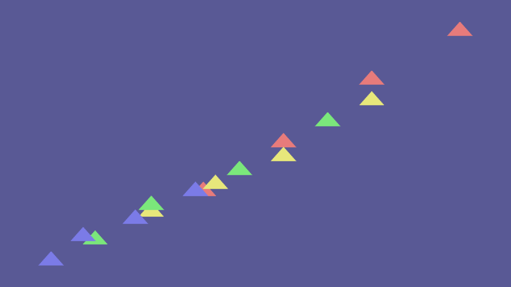

# Tutorial 6: Custom Marks

> **Goal**: Implement a new mark type from scratch using both the
> `#[derive(Mark)]` macro and a manual `Mark` trait implementation.

## What You Will Learn

- The role of the `Mark` trait in Gup's rendering pipeline
- How to create a custom mark with `#[derive(Mark)]` (quick path)
- How to implement `Mark` manually for full control (advanced path)
- How to register a mark with `MarkRegistry`
- How to validate your mark with `MarkValidator`

## Prerequisites

Complete [Tutorial 2](02_data_binding.md). Familiarity with `Selection<T, M>` is
assumed. You should also be comfortable with basic GPU concepts (vertices,
indices, shaders).

For the full architectural overview, see the
[Custom Mark Guide](../CUSTOM_MARK_GUIDE.md) and the
[Mark System documentation](../mark-system/README.md).

## The Mark Trait

Every visual element in Gup — circles, rectangles, lines, box plots — is a
**mark**. A mark defines:

1. **Geometry** — the vertices and indices that form the base shape
2. **Attributes** — named properties like `"center"`, `"radius"`, `"fill_color"`
3. **Shaders** — vertex and fragment WGSL programs for GPU rendering

The `Mark` trait captures this:

```rust,ignore
pub trait Mark: Clone + MaybeSend + MaybeSync + 'static {
    type Vertex: bytemuck::Pod + bytemuck::Zeroable;
    type AttributeValue: MaybeSend + MaybeSync + 'static;

    fn vertex_count() -> usize;
    fn index_count() -> Option<usize>;
    fn generate_vertices() -> Vec<Self::Vertex>;
    fn generate_indices() -> Option<Vec<u32>>;
    fn vertex_attributes() -> &'static [VertexAttribute];

    const VERTEX_SHADER: Option<&'static str> = None;
    const FRAGMENT_SHADER: Option<&'static str> = None;
}
```

## Quick Path: `#[derive(Mark)]`

The fastest way to create a mark is with the derive macro. Define a struct with
annotated fields and Gup generates the vertex type, instance buffer layout, and
boilerplate for you.

### Step 1: Define the Mark Struct

```rust,ignore
use gup::shader_function::{Vec2, Vec4};

#[derive(Debug, Clone, gup_macros::Mark)]
#[mark(primitive = "quad")]
pub struct Diamond {
    #[mark(position)]
    pub center: Vec2,

    #[mark(size)]
    pub size: f32,

    #[mark(color)]
    pub color: Vec4,

    #[mark(rotation)]
    pub angle: f32,
}
```

**Annotations**:

| Annotation                    | Purpose                                              |
| ----------------------------- | ---------------------------------------------------- |
| `#[mark(primitive = "quad")]` | Base geometry: `"quad"`, `"triangle"`, or `"circle"` |
| `#[mark(position)]`           | The field that positions the mark in clip space      |
| `#[mark(size)]`               | The field that controls the mark's scale             |
| `#[mark(color)]`              | The field that sets the fill colour                  |
| `#[mark(rotation)]`           | The field that rotates the mark (in radians)         |

The macro generates:

- `DiamondInstance` — a `#[repr(C)]`, `Pod`, `Zeroable` struct for the GPU
  instance buffer
- `impl Mark for Diamond` — with correct vertex count, indices, and attributes
- Automatic conversion from `Diamond` → `DiamondInstance`

### Step 2: Use It with a Selection

```rust,ignore
use gup::prelude::*;

#[derive(Debug, Clone)]
struct DataPoint {
    x: f32,
    y: f32,
    value: f32,
}

let mut selection = Selection::<DataPoint, Diamond>::from_data(data);
selection
    .attr("center", |d: &DataPoint| [d.x, d.y])
    .attr("size", |d: &DataPoint| 0.02 + d.value * 0.05)
    .attr("color", |d: &DataPoint| [d.value, 0.3, 1.0 - d.value, 0.8])
    .attr("angle", |_d: &DataPoint| 0.785); // 45° rotation
```

### Step 3: Validate

Use `MarkValidator` to check your mark at test time:

```rust,ignore
#[test]
fn test_diamond_mark_is_valid() {
    use gup::mark::validation::assert_mark_valid;
    assert_mark_valid::<Diamond>();
}
```

## Advanced Path: Manual Implementation

When you need full control over the geometry, shaders, or vertex layout,
implement `Mark` directly.

### Step 1: Define the Vertex Type

The vertex type must be `#[repr(C)]`, `Pod`, and `Zeroable`:

```rust,ignore
#[repr(C)]
#[derive(Debug, Clone, Copy, bytemuck::Pod, bytemuck::Zeroable)]
pub struct HexagonVertex {
    pub position: [f32; 2],
}
```

### Step 2: Define the Attribute Type

```rust,ignore
use gup::shader_function::{Vec2, Vec4};

#[derive(Debug, Clone)]
pub struct HexagonAttributes {
    pub center: Vec2,
    pub radius: f32,
    pub color: Vec4,
}
```

### Step 3: Implement `Mark`

```rust,ignore
use gup::mark::Mark;

#[derive(Debug, Clone)]
pub struct Hexagon;

impl Mark for Hexagon {
    type Vertex = HexagonVertex;
    type AttributeValue = HexagonAttributes;

    fn vertex_count() -> usize {
        7 // center + 6 outer vertices
    }

    fn index_count() -> Option<usize> {
        Some(18) // 6 triangles × 3 indices
    }

    fn generate_vertices() -> Vec<Self::Vertex> {
        // Center vertex
        let mut vertices = vec![HexagonVertex { position: [0.0, 0.0] }];

        // 6 outer vertices at 60° intervals
        for i in 0..6 {
            let angle = std::f32::consts::FRAC_PI_3 * i as f32;
            vertices.push(HexagonVertex {
                position: [angle.cos(), angle.sin()],
            });
        }
        vertices
    }

    fn generate_indices() -> Option<Vec<u32>> {
        Some(vec![
            0, 1, 2,  // triangle 1
            0, 2, 3,  // triangle 2
            0, 3, 4,  // triangle 3
            0, 4, 5,  // triangle 4
            0, 5, 6,  // triangle 5
            0, 6, 1,  // triangle 6
        ])
    }

    fn vertex_attributes() -> &'static [wgpu::VertexAttribute] {
        &[wgpu::VertexAttribute {
            offset: 0,
            shader_location: 0,
            format: wgpu::VertexFormat::Float32x2,
        }]
    }
}
```

### Step 4: Write Shaders (Optional)

For custom rendering, provide WGSL vertex and fragment shaders:

```rust,ignore
impl Mark for Hexagon {
    const VERTEX_SHADER: Option<&'static str> = Some(r#"
        struct VertexOutput {
            @builtin(position) clip_position: vec4<f32>,
            @location(0) color: vec4<f32>,
        };

        @vertex
        fn vs_main(
            @location(0) position: vec2<f32>,
            @location(1) center: vec2<f32>,
            @location(2) radius: f32,
            @location(3) fill_color: vec4<f32>,
        ) -> VertexOutput {
            var out: VertexOutput;
            let world_pos = position * radius + center;
            out.clip_position = vec4<f32>(world_pos, 0.0, 1.0);
            out.color = fill_color;
            return out;
        }
    "#);

    const FRAGMENT_SHADER: Option<&'static str> = Some(r#"
        @fragment
        fn fs_main(@location(0) color: vec4<f32>) -> @location(0) vec4<f32> {
            return color;
        }
    "#);

    // … other trait methods as above
}
```

### Step 5: Register with `MarkRegistry`

```rust,ignore
use gup::mark::MarkRegistry;

let mut registry = MarkRegistry::new();
registry.register::<Hexagon>();

assert!(registry.is_registered::<Hexagon>());
println!("Registered marks: {:?}", registry.registered_types());
```

The registry caches GPU render pipelines per mark type, so pipeline creation
(which is expensive) only happens once.

### Step 6: Validate and Profile

```rust,ignore
use gup::mark::validation::{MarkValidator, MarkProfiler, assert_mark_valid};

// Quick validation
assert_mark_valid::<Hexagon>();

// Detailed validation
let validator = MarkValidator::new::<Hexagon>();
let report = validator.validate();
println!("Validation: {:?}", report);

// Performance profiling
let profiler = MarkProfiler::new::<Hexagon>();
let perf = profiler.profile();
println!("Vertices: {}, Indices: {:?}", perf.vertex_count, perf.index_count);
```



## Quick Reference: Built-in Marks

Gup ships these marks out of the box:

| Mark        | Geometry     | Typical Use                       |
| ----------- | ------------ | --------------------------------- |
| `Circle`    | Triangle fan | Scatter plots, bubble charts      |
| `Rectangle` | Quad         | Bar charts, heatmaps              |
| `Line`      | Line strip   | Line charts, paths                |
| `BoxPlot`   | Composite    | Statistical box-and-whisker plots |
| `Text`      | SDF quads    | Labels, annotations               |
| `Path`      | Tessellated  | Geographic shapes, custom paths   |
| `Sphere3D`  | UV sphere    | 3D scatter plots                  |
| `Box3D`     | Cube         | 3D bar charts                     |
| `Line3D`    | Line strip   | 3D paths                          |

## Full Derive Example

```rust,no_run
use gup::prelude::*;
use gup::mark::validation::assert_mark_valid;
use gup::shader_function::{Vec2, Vec4};
use std::sync::Arc;

#[derive(Debug, Clone, gup::Mark)]
#[mark(primitive = "triangle")]
pub struct Arrow {
    #[mark(position)]
    pub position: Vec2,
    #[mark(size)]
    pub size: f32,
    #[mark(color)]
    pub color: Vec4,
}

#[derive(Debug, Clone)]
struct WindReading {
    x: f32,
    y: f32,
    speed: f32,
}

#[tokio::main]
async fn main() -> GupResult<()> {
    // Validate the mark at startup
    assert_mark_valid::<Arrow>();

    let data = vec![
        WindReading { x: 0.2, y: 0.3, speed: 0.5 },
        WindReading { x: 0.7, y: 0.8, speed: 0.9 },
        WindReading { x: 0.4, y: 0.1, speed: 0.3 },
    ];

    let context = Arc::new(RenderContext::new().await?);

    let mut selection = Selection::<WindReading, Arrow>::from_data(data);
    selection
        .attr("position", |d: &WindReading| [d.x * 2.0 - 1.0, d.y * 2.0 - 1.0])
        .attr("size", |d: &WindReading| 0.02 + d.speed * 0.05)
        .attr("color", |d: &WindReading| [d.speed, 0.3, 1.0 - d.speed, 0.8]);

    println!("Arrow mark selection ready ({} elements)", selection.len());
    Ok(())
}
```

## Key Concepts

| Concept              | What It Does                                                   |
| -------------------- | -------------------------------------------------------------- |
| `Mark` trait         | Defines geometry, attributes, and shaders for a visual element |
| `#[derive(Mark)]`    | Auto-generates Mark implementation from annotated struct       |
| `#[mark(primitive)]` | Sets the base geometry (quad, triangle, circle)                |
| `MarkRegistry`       | Caches render pipelines per mark type                          |
| `MarkValidator`      | Checks mark correctness at test time                           |
| `MarkProfiler`       | Measures mark performance characteristics                      |

## Next Steps

- **[Custom Mark Guide](../CUSTOM_MARK_GUIDE.md)** — the full architectural
  reference for the mark system.
- **[Mark System docs](../mark-system/README.md)** — detailed API reference for
  `MarkRegistry` and `MarkRenderer`.
- **[`custom_mark_demo` example](../../examples/custom_mark_demo.rs)** —
  runnable example with Diamond, Arrow, and Hexagon marks.
- **[Tutorial 1: Getting Started](01_getting_started.md)** — back to basics if
  you want to review the chart builder API.
